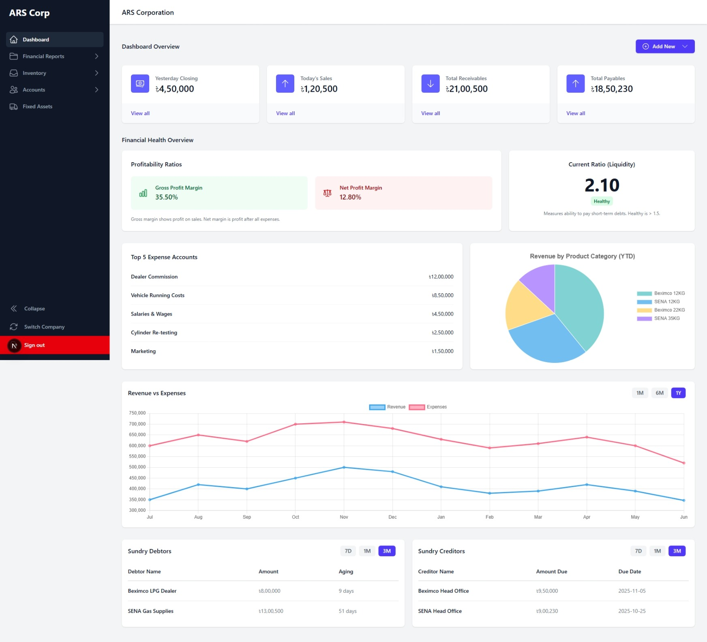
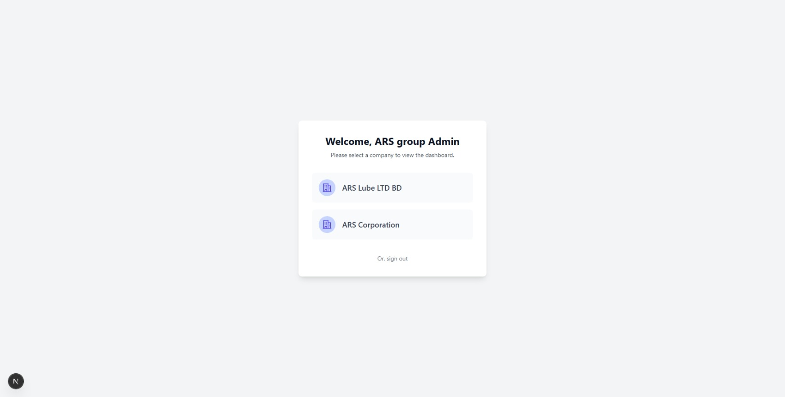
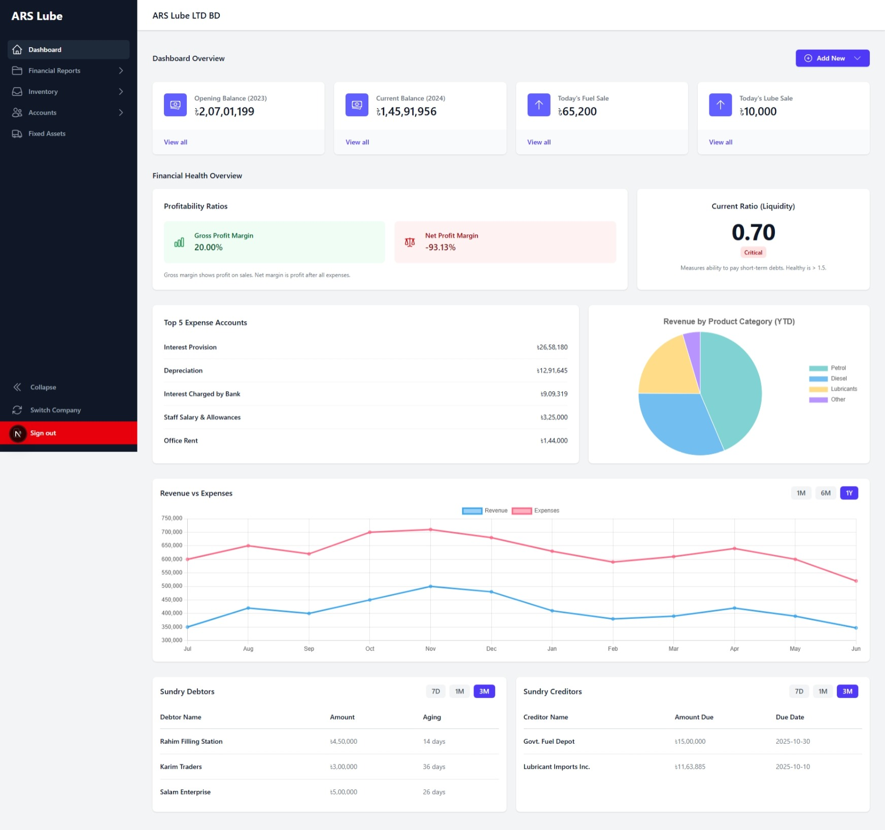
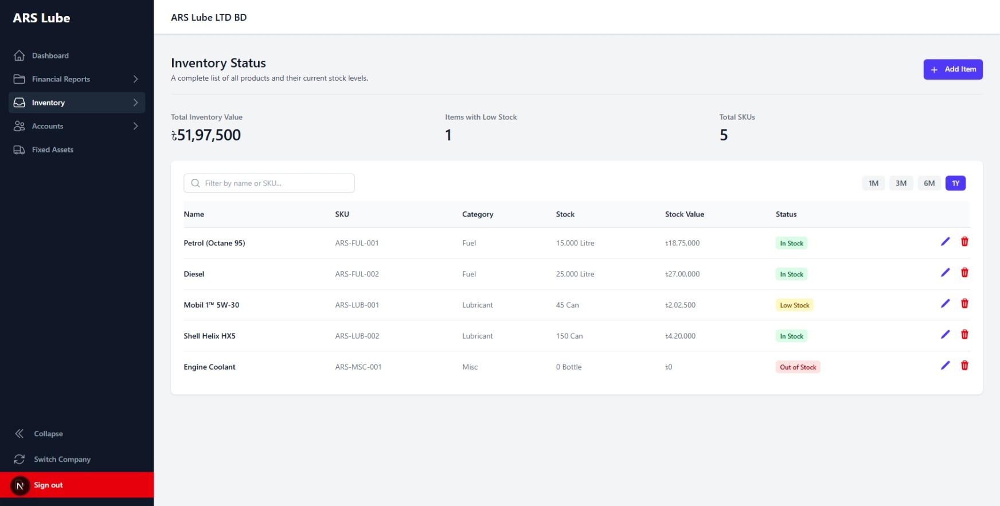
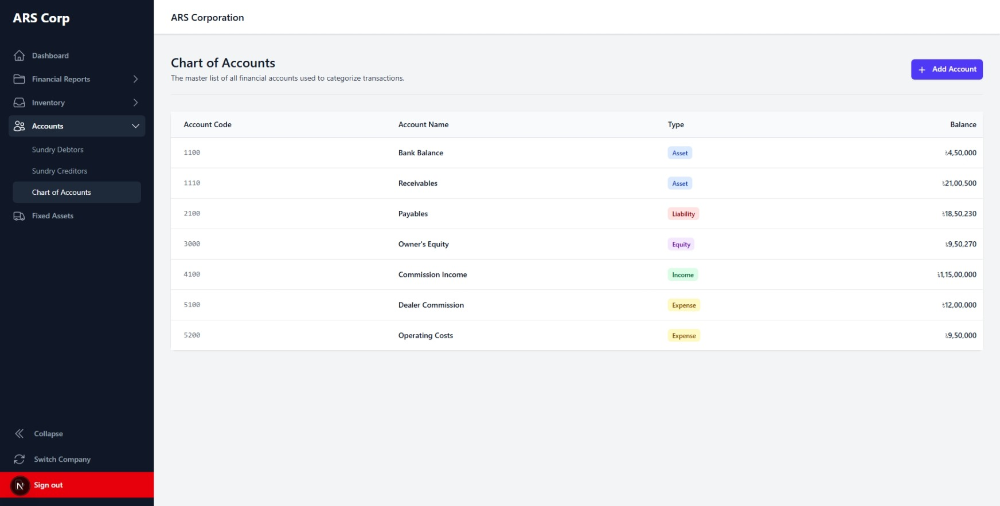

<div align="center">

# 🏢 ARS Group - Enterprise Resource Planning Dashboard

### A Modern, Full-Featured Business Intelligence & ERP System

[](https://nextjs.org/)
[](https://tailwindcss.com/)
[](https://www.chartjs.org/)
[](LICENSE)

<br/>

*A comprehensive enterprise dashboard built with modern web technologies, designed to provide real-time business insights, financial management, and inventory tracking for multi-company operations.*

<br/>

[🚀 Live Demo](#) • [📖 Documentation](#-getting-started) • [🐛 Report Bug](../../issues) • [✨ Request Feature](../../issues)

<br/>

</div>

---

## 📸 Screenshots

<div align="center">

### 🏠 Dashboard Overview
*Real-time KPIs, financial health metrics, revenue charts, and expense tracking at a glance*



---

### 🔐 Multi-Company Selection
*Seamlessly switch between different company dashboards with a clean, intuitive interface*



---

### 📊 Business Intelligence Dashboard
*Comprehensive analytics with profitability ratios, revenue trends, and creditor/debtor management*



---

### 📦 Inventory Management
*Complete inventory tracking with stock levels, SKU management, and status indicators*



---

### 📒 Chart of Accounts
*Professional accounting module with categorized accounts, types, and real-time balances*



</div>

---

## ✨ Key Features

<table>
<tr>
<td width="50%">

### 🏗️ Multi-Company Architecture
- Seamlessly switch between different company dashboards
- Isolated data and settings per company
- Role-based access control

### 📊 Real-Time Analytics
- Interactive charts with Chart.js
- Revenue vs Expenses trends
- Product category breakdown
- Time-period filtering (7D, 1M, 3M, 1Y)

### 💰 Financial Management
- Profitability ratios (Gross & Net Margin)
- Current ratio (Liquidity) tracking
- Top expense account monitoring
- Sundry debtors & creditors management

</td>
<td width="50%">

### 📦 Inventory Control
- Complete product catalog management
- Low stock alerts & indicators
- Purchase & sales tracking
- Process loss monitoring

### 📑 Financial Reports
- Balance Sheet
- Income Statement
- Cash Flow Statement
- Trial Balance

### 🔐 Security & Access
- Secure authentication system
- Company-level permissions
- Protected routes & API endpoints
- Session management

</td>
</tr>
</table>

---

## 🚀 Technology Stack

<div align="center">

| Category | Technologies |
|----------|-------------|
| **Frontend Framework** | Next.js 14 (Pages Router) |
| **Styling** | Tailwind CSS, Custom CSS |
| **UI Components** | Headless UI, Heroicons |
| **Data Visualization** | Chart.js, react-chartjs-2 |
| **State Management** | React Context API |
| **Code Quality** | ESLint, Prettier |

</div>

---

## 🛠️ Getting Started

### Prerequisites

- **Node.js** v18.x or higher
- **npm** or **yarn** package manager

### Installation

1. **Clone the repository**
   ```bash
   git clone https://github.com/NazifaTasnimShifa/ars-group-dashboard.git
   cd ars-group-dashboard
   ```

2. **Install dependencies**
   ```bash
   npm install
   # or
   yarn install
   ```

3. **Run the development server**
   ```bash
   npm run dev
   # or
   yarn dev
   ```

4. **Open in browser**
   
   Navigate to [http://localhost:3000](http://localhost:3000) to see the application.

### Demo Credentials

| Role | Email | Password |
|------|-------|----------|
| Admin | `admin@arsgroup.com` | Any password |

---

## 📁 Project Structure

```
ars-group-dashboard/
├── 📂 public/              # Static assets
├── 📂 src/
│   ├── 📂 components/      # Reusable UI components
│   ├── 📂 pages/           # Next.js pages
│   │   ├── 📂 accounts/    # Debtors, Creditors, Chart of Accounts
│   │   ├── 📂 inventory/   # Stock, Purchases, Sales
│   │   └── 📂 reports/     # Financial statements
│   └── 📂 styles/          # Global styles
├── 📄 tailwind.config.js   # Tailwind configuration
└── 📄 package.json         # Dependencies
```

---

## 🎯 Modules Overview

| Module | Description |
|--------|-------------|
| **Dashboard** | KPIs, financial health, charts, quick stats |
| **Accounts** | Sundry Debtors, Sundry Creditors, Chart of Accounts |
| **Inventory** | Status, Purchases, Sales, Process Loss |
| **Financial Reports** | Balance Sheet, Income Statement, Cash Flow, Trial Balance |
| **Fixed Assets** | Complete asset register with depreciation tracking |

---

## 🤝 Contributing

Contributions are welcome! Please feel free to submit a Pull Request.

1. Fork the project
2. Create your feature branch (`git checkout -b feature/AmazingFeature`)
3. Commit your changes (`git commit -m 'Add some AmazingFeature'`)
4. Push to the branch (`git push origin feature/AmazingFeature`)
5. Open a Pull Request

---

## 📄 License

This project is licensed under the MIT License - see the [LICENSE](LICENSE) file for details.

---

## 👩‍💻 Author

<div align="center">

**Nazifa Tasnim Shifa**

[](https://github.com/NazifaTasnimShifa)
[](mailto:nazifatasnimshifa@gmail.com)

---

<sub>⭐ Star this repository if you find it helpful!</sub>

</div>